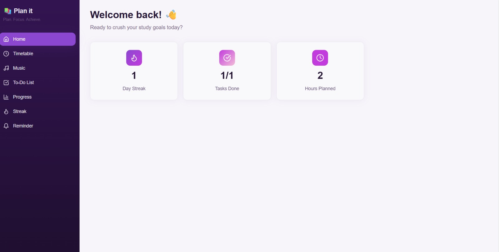
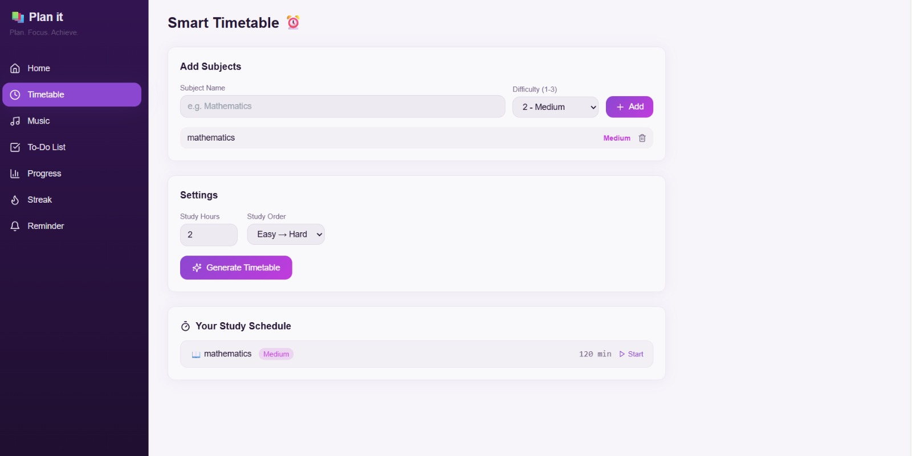
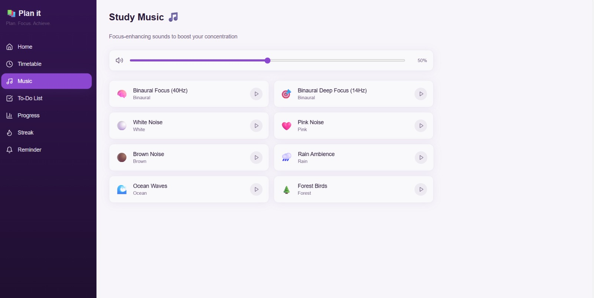

PLAN IT
Plan. Focus. Achieve.

 Problem Statement - 
This project was built as part of a hackathon challenge to design a productivity-based solution that helps users manage their time effectively.
Students often struggle with poor time management, lack of structured planning, burnout due to over-scheduling, and inconsistency in maintaining study habits.
Study Flow solves this problem by combining smart scheduling, focus tools, reminders, and progress tracking into a single unified platform.

 Features Implemented -
•	 Difficulty-based timetable generation
•	 Automatic break insertion between study sessions
•	 Built-in focus music (Binaural beats, white noise, rain sounds, etc.)
•	 To-Do list with live completion tracking
•	 Progress tracker with completion percentage
•	 Daily streak system for motivation
•	 Session reminder with sound buzzer
•	 Clean and responsive UI design

 How It Works -
•	Users add subjects and assign difficulty levels (EASY, MEDIUM, HARD).
•	The system prioritizes time allocation according to harder subjects.
•	Study sessions are automatically generated with structured break intervals.
•	Task completion updates progress percentage in real time.
•	Reminder buzzer alerts users at the end of sessions.

Tech Stack -
•	Frontend: HTML, CSS, JavaScript
•	Logic & Interactivity: JavaScript
•	Audio Reminder: Browser-based audio trigger
•	Platform Used: Lovable (for rapid development and UI design)

 Installation Guide -
If running locally:
1.	Clone the repository:
2. git clone https://github.com/pushpanjalich1985/PLAN-IT.git
3.	Navigate into the Project Directory
4.	Install Dependencies
5.	Open the project folder in your respecive IDE.
6.	Run the Project (npm run dev)

Learnings & Challenges -

We learnt to address and fix bugs.
Writing logic in code and prompt engineering.
How to coordinate in a team and use GitHub. 
Deploying and dealing with errors is a serious issue that we dealt with.

 Screenshots -

Deployment link -
https://study-plan-wheat.vercel.app/

Team Members -
•	Sahithi
•	Hemasree
•	Jahnavi
•	Pushpanjali

 Future Scope -
•	Smart AI-based adaptive scheduling
•	Cloud-based user accounts
•	Calendar integration
•	Personalized productivity analytics
